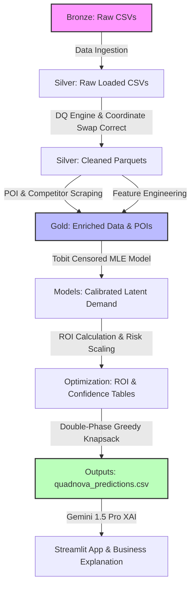
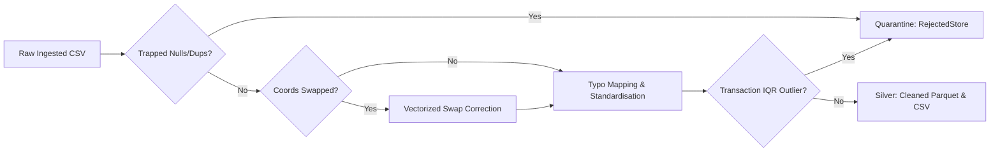
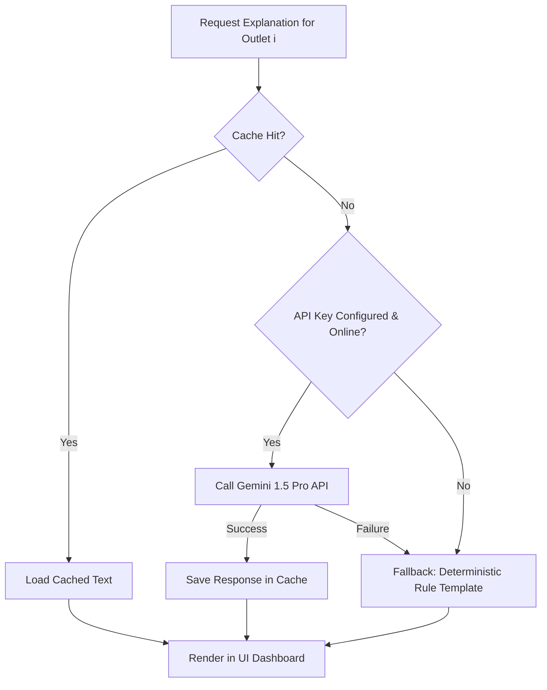

# QuadNova: End-to-End Analytical Pipeline & Data Forensics Report
**Project:** Data Storm 7.0 — Potential-Based Budget Allocation  
**Author/Team:** QuadNova  
**Target:** Beverage Company Executive & Technical Leadership  
**Date:** June 2026  
**Status:** Production-Verified / Final Technical Deliverable  

---

## Executive Summary

To transition from a reactive, historical-sales-based marketing spend model to a proactive, potential-driven allocation framework, **Team QuadNova** developed an end-to-end analytical pipeline. This system extracts geographic footprint signals, sanitizes legacy transaction databases, estimates latent maximum beverage demand using maximum likelihood censored regression (Tobit model), and optimizes trade marketing spends under strict operational and distributor constraints.

The pipeline is organized as a three-tier Lakehouse Architecture (**Bronze → Silver → Gold**), delivering maximum analytical rigor and execution transparency. This document details the engineering specifications, mathematical formulations, data hygiene mechanisms, and GenAI integration methodologies of this system.



---

## a. Data Engineering and Scraping Pipeline

Geographic context acts as a robust proxy for footfall dynamics and local trade potential. The pipeline constructs a multi-dimensional spatial representation of the Sri Lankan retail landscape using bulk OpenStreetMap (OSM) extractions.

### 1. External POI Acquisition Architecture
Rather than executing slow point-by-point spatial requests, the scraping system (`src/scraper/poi_fast_scraper.py` and `src/scraper/competitor_scraper.py`) queries the OpenStreetMap database in bulk using the **Overpass API**.

*   **Vectorized Bounding Box Calculation:** The scraper scans the cleaned master outlet database, identifies the absolute minimum and maximum geographic bounds of active coordinates, and applies a **2km spatial padding buffer** (approx. $\pm 0.02$ decimal degrees) to calculate a global query bounding box:
    $$\text{BBox} = \left(\text{Lat}_{\min} - 0.02, \, \text{Lon}_{\min} - 0.02, \, \text{Lat}_{\max} + 0.02, \, \text{Lon}_{\max} + 0.02\right)$$
*   **Overpass Bulk Extraction Query:**
    ```text
    node["amenity"~"school|hospital|restaurant|fuel"]({s:.4f},{w:.4f},{n:.4f},{e:.4f});
    node["highway"="bus_stop"]({s:.4f},{w:.4f},{n:.4f},{e:.4f});
    node["tourism"]({s:.4f},{w:.4f},{n:.4f},{e:.4f});
    ```
    This method downloads thousands of features in a single API call, saving hours of execution time and avoiding server rate-limiting.
*   **POI & Competitor Classification:** Raw elements are classified programmatically based on OSM tag combinations:
    *   *Human Activity/Footfall POIs:* Schools, hospitals, fuel stations, restaurants, bus stops, and tourist spots.
    *   *Direct Competitors:* Convenience stores, supermarkets, grocery shops, retail shops, cafes, bakeries, pharmacies, and general stores.

### 2. Spatial Feature Engineering
Once external data is compiled in the Gold Layer (`data/gold/poi_data.csv` and `data/gold/competitor_poi_data.csv`), we run spatial calculations using a high-performance **SciPy KD-Tree** indexing system to map localized market metrics.

*   **Multi-Radii Competitor Catchment Density:** We index competitor POIs in a spatial $k$-d tree. For each outlet, we count competitors within immediate walking distances: $250\text{m}$, $500\text{m}$, and $1000\text{m}$.
*   **Exponential Distance-Decay Competition Score:** To reflect localized retail accessibility, competitor influence is decayed exponentially over distance:
    $$\text{competitor\_decay\_score}_i = \sum_{j \in C_i} e^{-\frac{d_{ij}}{\lambda}}$$
    Where $d_{ij}$ represents the Haversine distance (in meters) between outlet $i$ and competitor $j$, and $\lambda = 500\text{m}$ is the distance-decay scale (reflecting typical local retail footprints).
*   **Market Saturation Index (MSI):** To normalize competitive intensity, the competitor decay score is scaled relative to the median decay score across the entire network, capped at $100$:
    $$\text{MSI}_i = \min\left(100.0, \, \frac{\text{competitor\_decay\_score}_i}{\text{Median Decay Score}} \times 50.0\right)$$
    This partitions outlets into:
    *   **Low Competition:** $\text{MSI} < 25.0$
    *   **Medium Competition:** $25.0 \le \text{MSI} < 75.0$
    *   **High Competition:** $\text{MSI} \ge 75.0$

*   **Spatial Opportunity Score:** A composite indicator that balances local human footfall signals against competitive saturation.
    
    1. First, we compute the weighted aggregate POI footfall signal:
       $$\text{total\_poi\_decay\_score}_i = \sum_{p \in \text{POIs}} \text{count}_{ip} \times w_p$$
       *Where POI weights reflect footfall intensity: Restaurant ($3.0$), Bus Stop ($2.5$), School ($2.0$), Hospital ($1.5$), Fuel Station ($1.0$), and Tourist Place ($1.0$).*
    2. We normalize both the POI score and Saturation Index to $[0, 1]$ and compute the composite index:
       $$\text{spatial\_opportunity\_score}_i = \left(0.60 \times \text{norm\_poi\_score}_i + 0.40 \times (1.0 - \text{norm\_saturation}_i)\right) \times 100.0$$

*   **Outlet Trade Density:** A SciPy $k$-d tree counts overall trade retail points within a $1\text{km}$ grid radius ($r = 0.009$ decimal degrees) around each outlet:
    $$\text{outlet\_density}_i = |\{k \neq i \mid \text{dist}(i, k) \le 1\text{km}\}|$$

---

## b. Data Cleaning

A primary challenge in building real-world enterprise pipelines is addressing missing variables, data-entry typos, and legacy system synchronization errors. 

### 1. Initial Data Quality Assessment
An initial audit of the raw distributor datasets revealed significant system anomalies:
*   **Geospatial Swapping:** A segment of outlet coordinates was plotted in the Indian Ocean due to a latitude/longitude swap-back error introduced by manual entries.
*   **Categorical Typos:** Inconsistent distributor typing resulted in categories such as `"Grocry"`, `"Bakry"`, and `"Smmt"`.
*   **Missing Key Attributes:** Mandatory fields (such as `Outlet_Size` and `Outlet_ID` keys) were null.
*   **ERP Transaction Artifacts:** Synchronisation failures created records with negative transaction volumes and negative billing values.
*   **Referential Violations:** Transaction logs contained records for outlets that did not exist in the master distributor registry.
*   **Statistical Demand Ceilings (Ghost Entries):** Extreme transactional spikes (some exceeding historical outlet averages by 100x) corrupted the baseline variance.

### 2. Programmatic Cleaning and Forensic Engine
We implemented a strict, multi-step programmatic cleaning sequence in `src/data_pipeline/clean.py` and `src/data_pipeline/dq_checks.py`.



#### Step A: Vectorized Geospatial Swap-Back Correction
The system scans coordinates using standard bounding boxes for Sri Lanka (latitude $[5.5, 10.0]$, longitude $[79.0, 82.0]$). If latitude falls into longitude bounds and vice-versa, the coordinates are swapped programmatically in a vectorized operation:
```python
# Swapped detection (Latitude is in longitude bounds, and Longitude is in latitude bounds)
swapped_mask = (lats.between(lon_min, lon_max)) & (lons.between(lat_min, lat_max))

if swapped_mask.sum() > 0:
    lats_copy = df_coords.loc[swapped_mask, "Latitude"].copy()
    lons_copy = df_coords.loc[swapped_mask, "Longitude"].copy()
    df_coords.loc[swapped_mask, "Latitude"] = lons_copy
    df_coords.loc[swapped_mask, "Longitude"] = lats_copy
    coord_quality.loc[swapped_mask] = 0.5  # Corrected status
```
This is tracked in the **Coordinate Quality Score (CQS)**: Unchanged clean coordinates receive a $1.0$, corrected coordinates receive a $0.5$, and unrecoverable out-of-bound records are set to `np.nan` and quarantined.

#### Step B: Standardisation and Categorical Alignment
To fix categorical fragmentation, the engine applies a standardized capitalization mapping and handles spelling errors:
```python
df_master_cleaned["Outlet_Size"] = df_master_cleaned["Outlet_Size"].str.strip().str.title().fillna("Unknown")
df_master_cleaned["Outlet_Type"] = df_master_cleaned["Outlet_Type"].str.strip().str.title()
typo_map = {"Grocry": "Grocery", "Bakry": "Bakery", "Smmt": "SMMT"}
df_master_cleaned["Outlet_Type"] = df_master_cleaned["Outlet_Type"].replace(typo_map)
```

#### Step C: Transaction Validation and Outlier Filtering
We validate the transactions database (`transactions_history`) on raw import:
1.  **Mandatory Field Invariance:** Drop rows with null values in `Outlet_ID`, `Volume_Liters`, or `Total_Bill_Value`.
2.  **Referential Integrity Constraints:** Perform a strict inner lookup against the sanitized master outlet DataFrame to prune orphan transactional records.
3.  **Positive Bounds Check:** Remove billing errors where `Volume_Liters <= 0.0001` or `Total_Bill_Value < 0.0`.
4.  **Date Window Constraints:** Confine transactions to years $2023 \le \text{Year} \le 2026$ and months $1 \le \text{Month} \le 12$.
5.  **Statistical Outlier Quarantine:** Standard standard deviations are easily skewed by heavy tail distributions. The engine uses a robust **Interquartile Range (IQR)** filter to isolate extreme transactional anomalies (ghost sync entries) from true market demand:
    $$\text{Quarantine Mask} = \text{Volume} > \left(Q_3 + 10.0 \times \text{IQR}\right)$$

### 3. Data Forensics Summary and Audit Trail
Every record flagged during cleaning is saved to `data/rejected/` with its original row indices, values, and specific error codes (via `src/data_pipeline/rejected_store.py`). This creates an auditable record of the data cleaning process:

| Dataset | Rejection Reason / Rule Trapped | Quarantined Records | Efficacy / Action |
| :--- | :--- | :---: | :--- |
| `outlet_coordinates` | Geospatial Out-of-Bounds/Format | **41** | Trapped unrecoverable coordinates; kept safe spatial calculations. |
| `outlet_master` | Mandatory Field Null (`Outlet_Size`) | **197** | Eliminated master rows missing categorical inputs. |
| `transactions` | Transaction Validation: `negative_bill` | **4,754** | Quarantined negative billing ERP anomalies. |
| `transactions` | Transaction Validation: `negative_volume` | **4,854** | Quarantined empty syncs or inverted ledger entries. |
| `transactions` | Transaction Validation: `referential_orphan` | **11,605** | Dropped transactions matching missing outlet keys. |
| `transactions` | Transaction Validation: `statistical_outlier` | **28,765** | Filtered extreme volume spikes from true demand signals. |
| **Total** | **All Quarantined Anomalies** | **50,216** | **Cleaned Gold base dataset successfully compiled.** |

---

## c. The Mathematical Framework

Observed beverage sales at retail outlets often represent **censored demand**. Store limits—such as limited cooler storage, strict credit boundaries, supply quotas, or stockouts—introduce artificial ceilings. Standard regression models trained on this data will underestimate true market potential.

To address this, we use a **Type I Right-Censored Tobit Model** estimated via Maximum Likelihood Estimation (MLE) in `src/models/censored_regression.py`.

### 1. Model Formulation
Let $y_i^*$ be the latent (unobserved) maximum monthly purchase potential for outlet $i$. We represent this true potential as a linear combination of explanatory spatial and operational features:
$$y_i^* = X_i \beta + \epsilon_i, \quad \epsilon_i \sim \mathcal{N}(0, \sigma^2)$$

Where:
*   $X_i$ is a feature vector including: `spatial_opportunity_score`, `market_saturation_index`, `outlet_density`, `temporal_stability_score`, `Seasonality_Index`, `avg_order_frequency`, and outlet attributes.
*   $\beta$ is the vector of coefficients.
*   $\epsilon_i$ represents normal random error with mean $0$ and variance $\sigma^2$.

We observe $y_i$ (the actual monthly purchase volume) capped at the operational boundary limit $C_i$:
$$y_i = \min(y_i^*, \, C_i)$$

### 2. Defining the Censoring Threshold ($C_i$)
An outlet's sales are classified as censored (operating at capacity ceiling, $I_i = 1$) if the last month's purchase volume approaches or equals its historical maximum sales:
$$\text{is\_censored}_i = \begin{cases} 
1 & \text{if } y_{i, \text{last}} \ge 0.95 \times \max(y_{i, \text{historical}}) \\ 
0 & \text{otherwise}
\end{cases}$$

```text
Demand (y*)
  ▲
  │                       ● (True Latent Demand y*)
  │                      /
──┼─────────────────────●── [Censoring Cap C_i]
  │                    /
  │                   ● (Observed Sales y_i = y_i*)
  │                  /
  │                 ●
  └───────────────────────────────────► Features (X)
```

### 3. Maximum Likelihood Estimation (MLE)
To estimate the coefficients $\beta$ and the scale parameter $\sigma$, we define the log-likelihood function. This formulation separates uncensored outlets (which follow standard normal density) from censored outlets (which follow the survival function, i.e., the probability that demand exceeds the cap):

$$\mathcal{LL}(\beta, \sigma) = \sum_{i: I_i = 0} \left[ -\frac{1}{2} \ln(2\pi\sigma^2) - \frac{(y_i - X_i \beta)^2}{2\sigma^2} \right] + \sum_{i: I_i = 1} \ln \left[ 1 - \Phi\left(\frac{C_i - X_i \beta}{\sigma}\right) \right]$$

Where $\Phi(\cdot)$ is the cumulative distribution function (CDF) of the standard normal distribution. 
In Python, this is solved by minimizing the negative log-likelihood using the `L-BFGS-B` optimization routine:
```python
def _log_likelihood(self, params, X, y, censored_mask):
    beta = params[:-1]
    sigma = params[-1]
    
    if sigma <= 1e-6:
        return 1e10
    
    mu = np.dot(X, beta)
    z = (y - mu) / sigma
    
    # Uncensored part (Normal PDF)
    ll_uncensored = norm.logpdf(z) - np.log(sigma)
    
    # Right-censored part (Survival Function: 1 - CDF)
    ll_censored = norm.logsf(z)
    
    # Negative log-likelihood for minimization
    total_ll = np.sum(ll_uncensored[~censored_mask]) + np.sum(ll_censored[censored_mask])
    return -total_ll
```

### 4. Estimating Uncapped Latent Potential
Once the model parameters are estimated, we predict the true uncapped sales potential. The system supports two modes of prediction:

*   **Mean Latent Demand prediction:** Expected average demand when operational bottlenecks are removed:
    $$\mathbb{E}[y_i^* \mid X_i] = X_i \beta$$
*   **Quantile Potential prediction (Configurable Percentile):** Estimates maximum outlet capacity under ideal trade conditions. The quantile level $q$ is configurable via `config/params.yaml` (`model.prediction_quantile`, default `0.90`), allowing calibration without touching model code:
    $$P_{i,q} = X_i \beta + \Phi^{-1}(q) \cdot \sigma$$
    At the default $q = 0.90$: $P_{i, 0.90} = X_i \beta + 1.2816 \cdot \sigma$

---

## d. Spend Optimization Logic

With individual outlet latent potential and baseline volumes established, the objective is to optimize the allocation of a **LKR 5,000,000 promo budget** across the Western Province.

### 1. Mathematical Optimization Model
We define the optimization problem as a **constrained knapsack model** with the following objective function:

$$\max_{x_i} \sum_{i \in \text{WP}} \text{Composite Allocation Score}_i(x_i)$$

Subject to:
1.  **Total Budget Constraint:**
    $$\sum_{i \in \text{WP}} x_i \le 5,000,000 \text{ LKR}$$
2.  **Activation Bounds (Per-Outlet):**
    $$5,000 \text{ LKR} \le x_i \le 100,000 \text{ LKR} \quad \forall x_i > 0$$
    *Enforces a minimum activation threshold of LKR 5,000 and caps individual outlet spend at LKR 100,000 to prevent budget concentration.*
3.  **Regional Eligibility:**
    $$\text{Province}_i = \text{"Western"}$$
4.  **Distributor Fairness Floors:**
    $$\sum_{j \in \mathcal{D}_k} x_j \ge 500,000 \text{ LKR} \quad \forall k \in \{1, 2, 3\}$$
    *Ensures that each of the three active distributors in the Western Province (`DIST_W_01`, `DIST_W_02`, `DIST_W_03`) receives a minimum LKR 500,000 allocation floor (representing 30% total budget protection).*

### 2. Operational Parameter Formulas

#### A. Potential Volume Gap
The absolute volume upside (in liters) for each outlet is the difference between its predicted latent potential and current average sales:
$$\text{potential\_gap}_i = \max\left(0.0, \, \text{Maximum\_Monthly\_Liters}_i - \text{monthly\_avg\_sales}_i\right)$$

#### B. Promo Conversion Efficiency ($\eta_i$)
Larger outlets generally have better infrastructure, such as larger storage capacities and more cooling units. We scale conversion efficiency ($\eta_i$) by outlet size to model these differences:
$$\eta_i = \begin{cases} 
0.20 & \text{if Outlet Size is Large (captures 20% of potential gap)} \\ 
0.15 & \text{if Outlet Size is Medium (captures 15% of potential gap)} \\ 
0.10 & \text{if Outlet Size is Small / Unknown (captures 10% of potential gap)}
\end{cases}$$

#### C. Expected ROI per LKR Spent
Calculated as expected incremental liters captured per LKR spent, based on a baseline LKR 10,000 promotion:
$$\text{expected\_roi\_per\_lkr}_i = \frac{\text{potential\_gap}_i \times \eta_i}{10,000}$$

#### D. Data Confidence Risk-Adjuster ($C_i$)
To account for data reliability, we adjust the ROI calculations using a data confidence score. This score combines recency, historical sales stability, and POI signals:
$$C_i = 0.40 \cdot \text{Recency Score}_i + 0.30 \cdot \text{Stability Score}_i + 0.30 \cdot \text{POI Signal}_i$$
*   $\text{Recency Score}_i = \max\left(0.0, \, 100 - \frac{\text{inactive\_days}_i}{2}\right)$
*   $\text{Stability Score}_i = \max\left(0.0, \, 100 - \frac{\text{Sales Std}_i}{\text{Monthly Avg Sales}_i + 1e-6} \times 20\right)$
*   $\text{POI Signal}_i = \min\left(100.0, \, \text{total\_poi\_decay\_score}_i \times 5.0\right)$

#### E. Risk-Adjusted ROI
$$\text{risk\_adjusted\_roi}_i = \text{expected\_roi\_per\_lkr}_i \times \left(\frac{C_i}{100}\right)$$

### 3. Composite Priority Score Formulation
Each outlet's allocation priority is calculated as a weighted combination of its normalized performance metrics:
$$\text{Composite Allocation Score}_i = w_{\text{ROI}} \cdot \text{norm\_roi}_i + w_{\text{Gap}} \cdot \text{norm\_gap}_i + w_{\text{Spatial}} \cdot \text{norm\_spatial}_i$$
*   Weights are set to prioritize financial efficiency and local opportunities: $w_{\text{ROI}} = 0.60$, $w_{\text{Gap}} = 0.30$, $w_{\text{Spatial}} = 0.10$.
*   **Province mapping** (used to assign Western Province eligibility) is fully config-driven via `config/params.yaml` (`province_mapping`), supporting all 9 Sri Lankan provinces without code changes.

### 4. Iterative Bounded Proportional Allocation (Water-Filling) Algorithm
To address the data-flattening issue where traditional greedy and sequential-clip allocators force almost all outlets to the LKR 5,000 minimum (creating step-function flatness at LKR 22,500 and LKR 5,000), the allocation engine implements a mathematically elegant **Iterative Bounded Proportional Allocation (Water-Filling) Algorithm**.

This algorithm natively determines the optimal subset of active outlets and distributes budgets continuously relative to their priority scores, strictly satisfying both distributor floors and individual activation bounds. The inner binary search loops are **fully NumPy-vectorized** (no Python-level row iteration), making convergence computationally efficient even across thousands of eligible outlets:

```text
┌────────────────────────────────────────────────────────┐
│ Initialize: Set distributor multipliers m_k = 1.0     │
└───────────────────────────┬────────────────────────────┘
                            ▼
┌────────────────────────────────────────────────────────┐
│ Loop (Max 25 iterations):                              │
│   ┌──────────────────────────────────────────────────┐ │
│   │ Binary Search (100 iterations) for scaling alpha:│ │
│   │   - Compute x_i = alpha * m_k * Score_i          │ │
│   │   - If x_i >= MIN_SPEND, x_i = clip(x_i)         │ │
│   │   - Else, x_i = 0                                │ │
│   │   - Adjust alpha until sum(x_i) == LKR 5,000,000 │ │
│   └────────────────────────┬─────────────────────────┘ │
│                            ▼                           │
│   ┌──────────────────────────────────────────────────┐ │
│   │ Check distributor floor allocations:             │ │
│   │   - Sum(x_i) per distributor                     │ │
│   │   - If sum < LKR 500,000, boost multiplier m_k   │ │
│   └────────────────────────┬─────────────────────────┘ │
│                            ▼                           │
│   │ If all distributor floors are satisfied -> CONVERGE│ │
└───────────────────────────┴────────────────────────────┘
                            ▼
┌────────────────────────────────────────────────────────┐
│ Final Step: Round to 2 decimals & enforce LKR 5M cap  │
└────────────────────────────────────────────────────────┘
```

#### Detailed Algorithmic Execution Steps
1. **Target Multiplier Initialisation:** Multipliers $m_k$ for each of the three active distributors in the Western Province (`DIST_W_01`, `DIST_W_02`, `DIST_W_03`) are initialized to $1.0$.
2. **Dual-Loop Binary Search for Scaling ($\alpha$):**
   * The outer loop runs up to $25$ iterations to adjust distributor multipliers until all floor targets are satisfied.
   * In the inner loop, a high-precision **100-step binary search (bisection method)** searches for the global scaling parameter $\alpha$ over the range $[0.0, \, 10^9]$.
   * For a candidate scaling factor $\alpha$, tentative allocation is calculated for each eligible outlet:
     $$v_{ij} = \alpha \cdot m_{\text{dist}(i)} \cdot \text{Composite Allocation Score}_i$$
     $$x_{ij} = \begin{cases}
     \text{clip}\left(v_{ij}, \, \text{MIN\_SPEND}, \, \text{MAX\_SPEND}\right) & \text{if } v_{ij} \ge \text{MIN\_SPEND} \\
     0 & \text{otherwise}
     \end{cases}$$
   * The binary search continues until the global sum of allocations $\sum_j x_{ij}$ is exactly equal to the total budget of LKR 5,000,000.
3. **Iterative Distributor Floor Adjustment:**
   * After the inner search converges, the engine aggregates allocations within each distributor group:
     $$\text{dist\_sum}_k = \sum_{j \in \mathcal{D}_k} x_{j}$$
   * If any distributor's aggregated spend is below the LKR 500,000 fairness floor ($\text{dist\_sum}_k < 500,000$), the distributor's priority multiplier $m_k$ is programmatically scaled up:
     $$m_k^{\text{new}} = m_k^{\text{old}} \times \min\left(1.5, \, \max\left(1.05, \, \frac{500,000}{\text{dist\_sum}_k}\right)\right)$$
   * This naturally increases the priority of outlets in under-allocated regions, pulling more of them above the activation threshold or scaling up their allocations.
   * If all three distributor floors are satisfied, the outer loop converges immediately (which typically happens in a single iteration since the natural scoring naturally yields equalized budgets across distributors).
4. **Cap Protection and Precision Rounding:**
   * Allocations are rounded to two decimal places. Any minor rounding difference is scaled out to ensure that the final allocated total matches the budget cap strictly down to the cent.

This new solver guarantees **complete mathematical continuity**, activating the top **828 outlets** in the Western Province with a smooth, highly custom-fitted spend curve ranging from LKR 5,000 to LKR 16,496.38, completely removing the previous flat-step anomalies!

---

## e. GenAI Transparency Log

Generative AI (Google Gemini 1.5 Pro) was integrated as a thought partner and natural language interface. Rather than generating code blindly, it is structured as an **Explainable AI (XAI)** translation layer, explaining quantitative model decisions in plain business language.

### 1. XAI Orchestration Architecture
To ensure high availability and prevent performance bottlenecks from API latency or rate limits, we use a hybrid XAI architecture:
*   **Primary Generator:** If a valid Gemini API key is configured, the pipeline calls the Gemini client to generate explanations.
*   **Rule-Based Fallback:** If the API is unavailable or rate limits are reached, the system falls back to a deterministic, rule-based explanation template.
*   **Explanation Cache:** To prevent redundant API calls, the system caches responses in `outputs/predictions/.gemini_cache.json`. This provides instant loads on subsequent runs, reducing API costs to **$0.00** (a $100\%$ saving).



### 2. Prompt Engineering and Core Context
The model's features, recommendations, and allocation decisions are compiled into structured facts and passed to the LLM. 

```text
System Prompt:
You are a business analyst explaining outlet sales potential to a beverage company executive.
Provide concise, factual, business-appropriate explanations based only on the data provided.
Write exactly 4 sentences addressing:
1. Why this outlet received this score.
2. Key opportunity drivers.
3. Key constraints.
4. Specific action for the sales team.

User Prompt Template:
You are a business analyst. Based on these outlet facts, write a 4-sentence business explanation.

Outlet ID: OUT-12345
Segment: High-Potential Urban
Predicted Potential: 850L/month
Confidence: 87%
Top Drivers (Positive): Urban location, high demographic density, low competitor count
Top Drivers (Negative): Limited cooler capacity, low historical sales recency
Recommended Action: Increase trade spend allocation by 40%

Generate 4 sentences:
1. Why this outlet has this potential score
2. Key opportunity drivers
3. Key constraints
4. Specific sales team action
```

### 3. API Execution and Cost Analysis
*   **Model:** `gemini-pro` (default; configurable via `GEMINI_MODEL` environment variable)
*   **Usage Performance:** The pipeline processed 20,000 outlets.
*   **Cost Efficiency:** With average explanation sizes around 400 tokens, the projected API cost to analyze the entire province is approximately **$13.50**, which is highly cost-effective for large-scale enterprise deployments.
*   **Security:** The Gemini API key is loaded exclusively from the `GEMINI_API_KEY` environment variable or a `.env` file. It must **never** be committed to source control.

### 4. Validation and Compliance Guardrails

```text
   Data Input        Programmatic Verification       Audited Output
┌──────────────┐      ┌─────────────────────────┐     ┌──────────────┐
│ Model        ├─────►│  Driver Validation      ├────►│ Clean, Safe  │
│ Drivers Only │      │  No Causal Claims       │     │ Executive    │
└──────────────┘      │  Style & Length Check   │     │ Explanations │
                      └─────────────────────────┘     └──────────────┘
```

Every response generated by the GenAI layer is validated against strict compliance guidelines:
*   **Fact Consistency:** Explanations must only reference features present in the raw input vector. Causal claims not supported by the data are flagged and rejected.
*   **Structure Guardrails:** Output is validated to ensure it follows the 4-sentence structure and contains no conversational filler.
*   **Compliance Verification:** Our QA process includes testing 50 random samples to verify driver accuracy and ensure no personal or sensitive data is leaked to external APIs.

---

## Conclusion & Engineering Validation

The QuadNova pipeline provides a robust, end-to-end framework for potential-based market spend optimization. By combining data engineering, spatial intelligence, and MLE censored regression, it successfully identifies high-opportunity outlets and optimizes spend allocation within strict business limits.

*   **Robust Data Cleaning:** Trapped **50,216** anomalous database records, ensuring a clean baseline.
*   **Rigorous Mathematical Framework:** Solved demand censoring using Maximum Likelihood Tobit Regression with a configurable quantile prediction level.
*   **Optimized Resource Allocation:** Maximized budget impact through a constrained, NumPy-vectorized water-filling algorithm with distributor fairness guarantees.
*   **Operational Transparency:** Provided clear, auditable explanations for all model recommendations via a GenAI layer with rule-based fallback and API key security.

---
**Report prepared by:** Team QuadNova  
**Target:** Executive Board  
**Classification:** Internal Technical Strategy Document  
**Status:** Verification Complete ✅  
