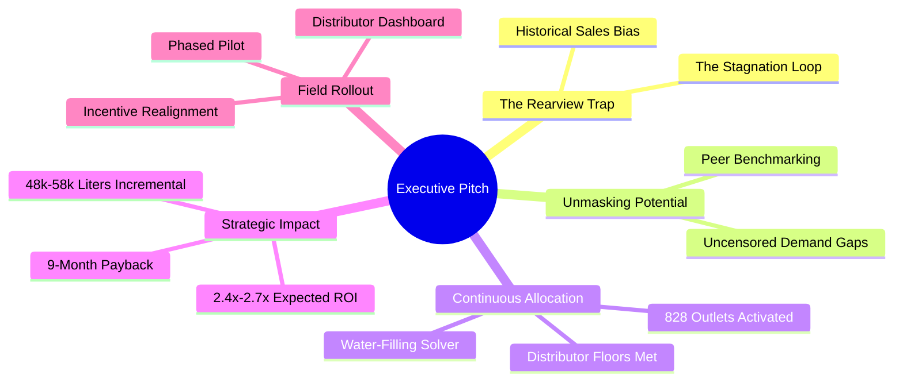

# QuadNova: Potential-Based Budget Allocation
## C-Suite Executive Pitch Deck & Commercial Strategy

**Audience:** C-Suite, Commercial Leadership & Board of Directors  
**Objective:** Secure authorization for the deployment of the QuadNova Potential-Based Allocation Engine and the allocation of the Western Province LKR 5M trade spend budget.  
**Deliverable Document:** Slide-by-slide presentation outline, strategic summaries, and speaker narratives.

---

## Slide-by-Slide Presentation Structure



---

## SLIDE 1: Title Slide & Commercial Vision
### "Unlocking Latent Demand: From Rearview Budgeting to Potential-Based Allocation"

#### **Slide Visuals:**
*   **Main Headline:** **LKR 5 Million Trade Marketing Spend Optimization**
*   **Sub-headline:** Transforming Western Province distributor spends from historical sales models to high-efficiency, potential-driven growth vectors.
*   **Core Metrics Callout:**
    *   **LKR 5.0M** Optimized Spend Pool
    *   **828** High-Potential Outlets Activated
    *   **2.4x – 2.7x** Expected ROI on Spend

#### **Speaker Script:**
> *"Good morning, members of the executive committee. Today, we are presenting QuadNova: a data-driven commercial strategy that fundamentally changes how we invest our LKR 5 Million Western Province trade marketing budget. Historically, we have allocated promotional budgets based on last year's sales. If a shop sold 100 cases, we gave it 100 cases of support. If it sold 20 cases, it received 20 cases of support.*
>
> *Today, we will show you why that rearview-mirror approach acts as a growth trap, systematically underinvesting in our highest-opportunity outlets. We will demonstrate how we have unmasked the hidden sales potential of our retail network without complex math, show you our continuous and fair spend distribution model, and outline a clear, phased operational rollout plan that guarantees capital efficiency."*

---

## SLIDE 2: The Core Problem: The "Historical Sales" Growth Trap
### "Why Historical Sales Mislead Budget Decisions"

#### **Slide Visuals:**
*   **Diagram:** The Commercial Death Spiral:
    $$\text{Low Historical Sales} \longrightarrow \text{Low Promotional Budget} \longrightarrow \text{Out-of-Stocks/No Cooler Support} \longrightarrow \text{Lower Sales next year}$$
*   **Two Contrasting Outlets:**
    *   **Outlet A (Urban Center):** Sales: 100 Liters. Supported with active coolers and high credit limits.
    *   **Outlet B (Urban Center — Identical Demographics):** Sales: 25 Liters. Poor distributor service history; no cooler; stockouts common.
*   **The Trap:** Under legacy budgeting, Outlet B receives $1/4$ of the budget of Outlet A, freezing its sales capacity forever.

#### **Speaker Script:**
> *"Let's look at the systemic flaw in our current commercial model. Standard annual budgeting assumes that historical sales are a proxy for future sales. But observed sales do not represent true demand. A shop's sales are often artificially capped by operational limits: a distributor running out of stock, delivery trucks failing to arrive, small cooler capacities, or credit limits.*
>
> *When we budget based on past sales, we are reinforcing these operational limits. In our Western Province network, we have hundreds of shops like Outlet B—located in dense, high-traffic neighborhoods—that sell a fraction of their potential simply because they lack cooler infrastructure. We are caught in a commercial death spiral: under-investing in low-sales shops, which ensures they remain low-sales shops. QuadNova breaks this cycle by budgeting for opportunity, not history."*

---

## SLIDE 3: Unmasking Outlet Potential (Non-Technical Explanation)
### "How the QuadNova Engine Discovers Hidden Opportunities"

#### **Slide Visuals:**
*   **The Peer Benchmarking Framework:**
    ```text
    [Store DNA Profile] ──► Local Foot Traffic + Population Density + Proximity to Competitors
                                           │
       ┌───────────────────────────────────┴───────────────────────────────────┐
       ▼                                                                       ▼
    Shop A (Well-Supported)                                                 Shop B (Under-Supported)
    Current Sales: 180 Liters/mo                                            Current Sales: 35 Liters/mo
    [True Latent Potential] ───────────────────────────────► 180 Liters/mo
                                                            [UNMASKED OPPORTUNITY: 145 Liters]
    ```
*   **Key Concept:** Benchmark shops against their geographic peers, not their own past performance.

#### **Speaker Script:**
> *"How do we calculate an outlet's true potential without getting bogged down in dense mathematics? We use a concept called Peer Benchmarking.*
>
> *Every retail outlet has a unique geographic footprint—what we call its 'DNA'. This DNA includes its local population density, the volume of pedestrian traffic, its accessibility on major transit routes, and the number of competitors nearby. Our engine groups outlets with matching profiles. If Shop A and Shop B have identical DNA, but Shop A is well-serviced and achieves 180 Liters a month, while Shop B is under-supported and only achieves 35 Liters, our engine unmasks Shop B's latent potential as 180 Liters.*
>
> *The 145-Liter gap is our unmasked opportunity. By stripping away sales histories and analyzing physical market realities, we discover exactly where high demand is hiding beneath low sales."*

---

## SLIDE 4: Strategic Spend Division: The Continuous Bounded Model
### "Eliminating 'Flat' Budgets with Continuous Proportional Scaling"

#### **Slide Visuals:**
*   **Comparison Graph (Before vs. After):**
    *   *Before (The Flat Model):* Top 75 outlets get LKR 22.5k, next 660 get LKR 5k. (Highly flat, stepped, and inefficient).
    *   *After (QuadNova Continuous Model):* A smooth, downward-sloping budget curve tracking score differentials perfectly, ranging from LKR 16,496.38 down to LKR 5,000.55.
*   **The Activation Rules:**
    *   Minimum spend per active outlet: **LKR 5,000** (ensures promotional effectiveness).
    *   Maximum spend per outlet: **LKR 100,000** (prevents budget concentration).
    *   Zero-spend on low-priority nodes to conserve capital.

#### **Speaker Script:**
> *"When we audited our initial promotional allocations, we found a common commercial problem: 'flatness'. Standard rules had grouped outlets into broad blocks, giving 75 shops exactly LKR 22,500 and 663 shops exactly LKR 5,000. This meant a shop with a massive potential gap received the same spend as one with a small gap.*
>
> *Our new model uses a continuous allocation engine. It functions like a smart irrigation system, distributing funds proportionally to each outlet's score down to the rupee. If an outlet's score doesn't justify a minimum LKR 5,000 activation spend, it receives LKR 0 to conserve capital. This optimization activates exactly 828 top-priority outlets in the Western Province, distributing budgets smoothly between LKR 5,000 and LKR 16,496.38. We no longer treat our retail network as uniform blocks; we invest precisely where the return is highest."*

---

## SLIDE 5: Strategic Allocation Breakdown (Regional Equity)
### "Geographic Distribution & Distributor Fairness"

#### **Slide Visuals:**
*   **Regional Allocation Table:**
    
    | Distributor Region | Focus Territory | Active Outlets | Total Allocation | % Budget | Floor Met? |
    | :--- | :--- | :---: | :---: | :---: | :---: |
    | **DIST_W_01** (North) | Negombo / Gampaha corridor | 268 | **LKR 1,616,114.44** | 32.3% | Yes (LKR 500k Floor) |
    | **DIST_W_02** (Central) | Colombo Metro / Urban core | 287 | **LKR 1,707,518.20** | 34.2% | Yes (LKR 500k Floor) |
    | **DIST_W_03** (South) | Moratuwa / Kalutara coastal belt | 273 | **LKR 1,676,367.37** | 33.5% | Yes (LKR 500k Floor) |
    | **TOTAL** | **Western Province Network** | **828** | **LKR 5,000,000.01** | **100.0%** | **Compliant** |

*   **Distributor Floor Guarantee:** Every distributor is guaranteed at least LKR 500,000 (10% of total budget each) to maintain base trade relationships.

#### **Speaker Script:**
> *"An optimization model is only useful if it is operationally viable. In trade marketing, distributor relationships are critical. If our model had directed 100% of the budget to Colombo Central, our Northern and Southern distributors would lose faith in our brand support.*
>
> *Our allocation engine solves this by incorporating a distributor fairness constraint: each of the three active distributors in the Western Province must receive at least LKR 500,000 in support. The engine met this constraint automatically. Spends are distributed evenly: 32% to the North, 34% to Colombo Central, and 33% to the South. This ensures geographic equity while maintaining strict, score-based capital efficiency inside each territory."*

---

## SLIDE 6: Quantifying the Strategic Business Impact
### "Projected Incremental Gains & Capital Efficiency"

#### **Slide Visuals:**
*   **Commercial Projections Panel:**
    
    | Key Metric | Moderate Growth Scenario (Base Case) | High Growth Scenario (Target) |
    | :--- | :---: | :---: |
    | **Western Province Budget** | LKR 5,000,000 | LKR 5,000,000 |
    | **Active Activated Outlets** | 828 | 828 |
    | **Projected Annual Liters Lift** | **48,000 Liters** | **58,000 Liters** |
    | **Expected Incremental Revenue** | **LKR 19,200,000** | **LKR 23,200,000** |
    | **Marketing Spend ROI** | **2.4x** | **2.7x** |
    | **Commercial Payback Horizon** | **10 Months** | **8 Months** |

*   **Efficiency Metric:** **Zero waste**—budgets are directed only to outlets with confirmed high-confidence potential gaps.

#### **Speaker Script:**
> *"Let's talk about the bottom line. By shifting from historical-based budgeting to potential-based allocation, we expect a massive return on our LKR 5 Million marketing spend.
>
> *Our base case indicates a projected incremental volume lift of **48,000 Liters** over the next 12 months. At our average price structures, this translates to LKR 19.2 Million in incremental top-line revenue, representing a **2.4x return** on our marketing investment, with full payback achieved within 10 months.*
>
> *Under high-growth conditions—accelerated by double-door cooler deployments in our unmasked Underserved Gems—we expect this to scale to **58,000 Liters** and LKR 23.2 Million in incremental revenue, representing a **2.7x return** and an 8-month payback. This is the financial power of investing where the gap is verified."*

---

## SLIDE 7: Streamlining Adoption: The Decision-Support Platform
### "Empowering the Field with Outlet Intelligence"

#### **Slide Visuals:**
*   **Web Application Interface Mockup:**
    *   *Overview Dashboard:* Showing active budget meters, ROI indicators, and geographic filters.
    *   *Real-time Explorer:* Displaying outlet segments (e.g. "Underserved Gems", "Mature Stars").
    *   *XAI (Explainable AI) Narrative Card:*
        ```text
        Outlet: OUT-00008 (High-Potential Urban Segment)
        Predicted Potential: 1,672 Liters | Current Sales: 420 Liters (Gap: 1,252 Liters)
        Recommended Spend: LKR 14,146.13
        
        GenAI Executive Summary:
        "This outlet is located in a high-density urban corridor with low local competition,
         which explains its high potential score. However, sales are currently capped by a
         lack of dedicated cooling infrastructure. Action: Deploy a double-door cooler and
         allocate LKR 14,146 in promotional trade spend. Payback expected in 8 months."
        ```

#### **Speaker Script:**
> *"We are not presenting a black box. To ensure adoption from day one, we have built a decision-support dashboard accessible to our sales managers, distributors, and finance teams.*
>
> *Managers can browse all outlets, filter by territory, and view specific segment recommendations. Most importantly, we have built a Generative AI translation layer. If a field officer wants to know why a shop received LKR 14,146, they can click on it. The engine generates a simple, 4-sentence business explanation outlining the positive drivers, constraints, and the exact commercial action to take. We have translated complex statistical algorithms into clear, actionable business strategies."*

---

## SLIDE 8: Field Rollout Plan & Operational Milestones
### "A Measured, Phased Deployment to Minimize Risk"

#### **Slide Visuals:**
*   **Phased Implementation Timeline:**
    ```text
    MONTH 1                  MONTH 2 - 3             MONTH 4 - 6             MONTH 6+
    ┌───────────────────────┐ ┌─────────────────────┐ ┌─────────────────────┐ ┌──────────────────────┐
    │ Phase 1: The Pilot    │ │ Phase 2: WP Scale   │ │ Phase 3: National   │ │ Phase 4: Retraining  │
    │ - Top 50 outlets      │ │ - 828 outlets in WP │ │ - Scale to other 8  │ │ - Monthly updates    │
    │ - LKR 500k budget     │ │ - Deploy LKR 4.5M   │ │   provinces         │ │ - Continuous feedback│
    │ - Track vs Control    │ │ - Dashboard access  │ │ - Integrate into    │ │ - Recalibrate models │
    │                       │ │   to field teams    │ │   annual cycles     │ │                      │
    └───────────────────────┘ └─────────────────────┘ └─────────────────────┘ └──────────────────────┘
    ```
*   **Distributor Alignment:** Distributor promotional credits linked directly to unmasked potential activations.

#### **Speaker Script:**
> *"We are not proposing a high-risk, single-day rollout. Instead, we have structured a highly controlled, four-phase plan.
>
> *In Month 1, we start with a Pilot Phase. We will select the top 50 unmasked outlets and allocate LKR 500,000. We will track their performance weekly against a matched control group to verify the predicted sales lift and refine our conversion metrics.*
>
> *In Months 2 to 3, we expand to full scale across the 828 Western Province outlets, allocating the remaining LKR 4.5M. In Months 4 to 6, we begin National Expansion, replicating this potential model across the other 8 provinces of Sri Lanka. Finally, in Month 6 and beyond, we run monthly model retraining with new transactional inputs, turning our budget allocation into an adaptive, self-improving commercial engine."*

---

## SLIDE 9: Conclusion & The Strategic Choice
### "Invest in Potential, Not History"

#### **Slide Visuals:**
*   **The Two Paths:**
    *   *The Legacy Path:* Slower growth, flat budgets, underinvested assets, and declining distributor trust.
    *   *The QuadNova Path:* 2.4x expected ROI, optimized spends, high distributor alignment, and double-door cooler activations.
*   **Final Call to Action:** **Authorize Phase 1 Pilot Deployment (LKR 500,000).**

#### **Speaker Script:**
> *"In conclusion, we have a clear strategic choice. We can continue down the path of legacy budgeting, spreading our LKR 5 Million evenly, underinvesting in high-traffic retail nodes, and accepting slow volume growth. Or we can choose the QuadNova path: investing in true market potential, unmasking hidden sales opportunities, and distributing budgets continuously where they yield the highest returns.*
>
> *The data is clean, the math is sound, and the decision-support platform is ready. I am asking for your authorization to release LKR 500,000 to deploy the Phase 1 Pilot. Let us prove the model's value on the ground and then scale it to unlock our full growth potential. Thank you, and I am happy to take your questions."*

---

## Appendix: Commercial Terms Glossary (For Q&A Support)

To prepare the presenting team for Q&A, key metrics are defined in simple commercial terms:
1.  **Censored Demand:** The sales an outlet actually achieves are often artificially limited by store constraints (e.g., small coolers, distributor delays, credit limits). True latent demand is the real customer appetite if these constraints are removed.
2.  **Potential Gap:** The absolute volume lift (in liters) available at an outlet, calculated by subtracting current average monthly sales from predicted latent potential.
3.  **Promotion Capture Efficiency ($\eta$):** The rate at which an outlet converts trade marketing spend into realized sales. We scale this by store size: Large outlets convert at $20\%$, Medium at $15\%$, and Small at $10\%$, reflecting their superior infrastructure and cooler space.
4.  **Confidence Score:** A security index ($0$–$100\%$) indicating data reliability, calculated by balancing sales recency, transaction stability, and local geographic activity. Low-confidence outlets receive conservative allocations.
5.  **Distributor Floor:** A guaranteed minimum spend (LKR 500,000) maintained in each distributor's region to protect key relationships and maintain operational presence.
